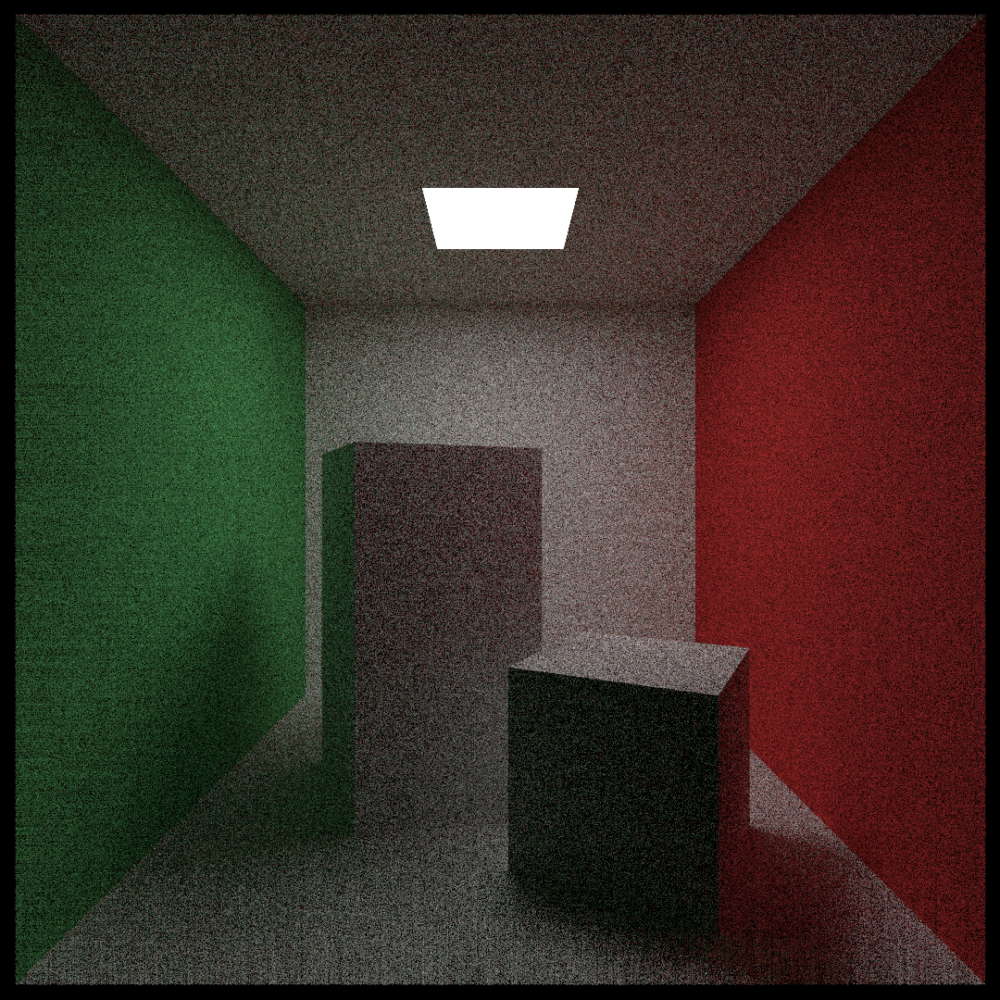

# raytracing

This project is a test bench I built to learn raytracing and more.

I am currently working on a CPU implementation of the algorithms detailed in [the raytracing books series](https://raytracing.github.io/) by Peter Shirley.

## Media

